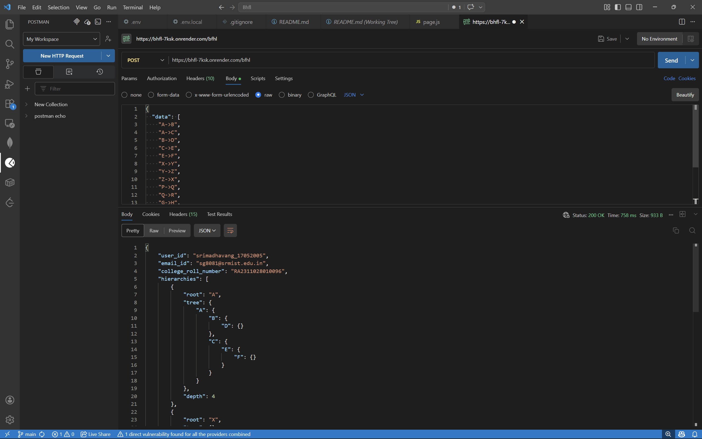
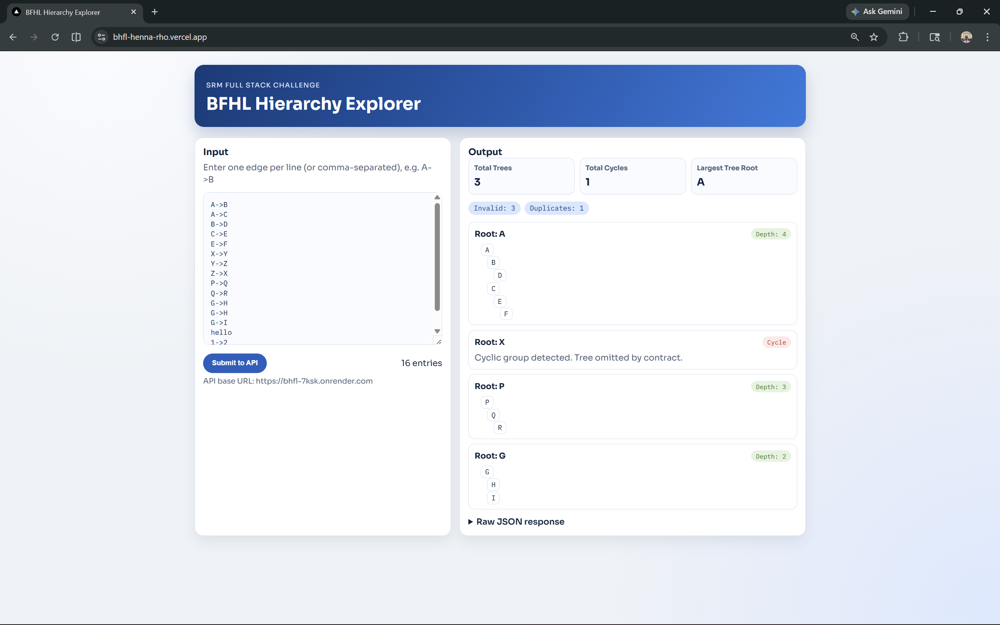

# BFHL Hierarchy Explorer

Full-stack implementation for the SRM Full Stack Engineering Challenge.

## Overview

This project contains:

1. Backend API (`POST /bfhl`) using Node.js + Express.
2. Frontend SPA using Next.js to submit node input and visualize structured output.

The API validates node edges, removes duplicates, handles multi-parent rules, detects cycles, computes tree depth, and returns summary insights.

## Tech Stack

1. Frontend: Next.js (App Router)
2. Backend: Node.js, Express
3. Hosting target: Vercel (frontend), Render (backend)

## Repository Structure

1. `backend` - Express API service
2. `frontend` - Next.js UI
    
## API Specification

1. Method: `POST`
2. Path: `/bfhl`
3. Content-Type: `application/json`

Sample request body:

```json
{
  "data": ["A->B", "A->C", "B->D"]
}
```

## Implemented Processing Rules

1. Valid format: `X->Y` where X and Y are single uppercase letters.
2. Trim whitespace before validation.
3. Self-loop (`A->A`) is invalid.
4. Duplicate edge behavior:
   First occurrence is used.
   Repeated occurrences are listed once in `duplicate_edges`.
5. Multi-parent behavior:
   First encountered parent for a child wins.
   Later parent edges for that child are discarded.
6. Pure cycle groups have `has_cycle: true`, `tree: {}`, and no `depth`.
7. `largest_tree_root` uses lexicographical tie-break for equal depth trees.

## Local Setup

### 1. Backend

```bash
cd backend
npm install
```

Create `.env` in `backend` using `.env.example`:

```env
PORT=8080
USER_ID=fullname_ddmmyyyy
EMAIL_ID=your.college@example.edu
COLLEGE_ROLL_NUMBER=YOUR_ROLL_NUMBER
```

Run backend:

```bash
npm run dev
```

### 2. Frontend

```bash
cd frontend
npm install
```

Create `.env.local` in `frontend` using `.env.local.example`:

```env
NEXT_PUBLIC_API_BASE_URL=http://localhost:8080
```

Run frontend:

```bash
npm run dev
```

Open `http://localhost:3000`.

## Screenshots

### Postman Test


### Frontend UI
